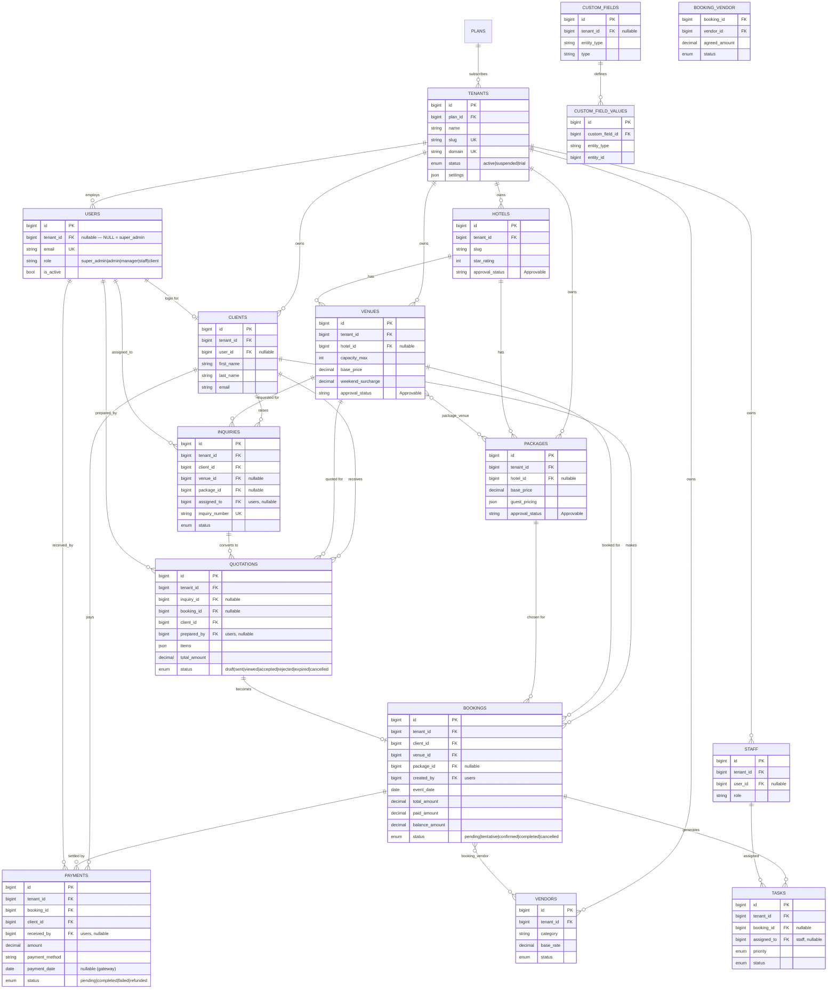

# EventPro — Developer & Viva Guide

> An exhaustive, method-level companion to the codebase. Where the root
> [`README.md`](../README.md) is the 5-minute overview, **this** document explains *every*
> function, how they call each other, the full file structure, and the reasoning behind the
> architecture — enough to defend the project in a long viva.

---

## Table of contents

1. [Introduction & the three audiences](#1-introduction--the-three-audiences)
2. [Tech stack & what each package does](#2-tech-stack--what-each-package-does)
3. [The request lifecycle (how a click becomes a page)](#3-the-request-lifecycle)
4. [Multi-tenancy deep-dive](#4-multi-tenancy-deep-dive)
5. [Authentication & authorization](#5-authentication--authorization)
6. [Complete file-structure map](#6-complete-file-structure-map)
7. [Module-by-module reference](#7-module-by-module-reference)
8. [Services catalogue (business logic)](#8-services-catalogue)
9. [Models & database schema](#9-models--database-schema)
10. [Cross-cutting subsystems](#10-cross-cutting-subsystems)
11. [Frontend architecture (Inertia + Vue)](#11-frontend-architecture)
12. [Console commands & scheduling](#12-console-commands--scheduling)
13. [Testing](#13-testing)
14. [Local setup & running](#14-local-setup--running)
15. [Viva quick-reference / likely Q&A](#15-viva-quick-reference--likely-qa)

---

## 1. Introduction & the three audiences

**EventPro** is a **white-label, multi-tenant SaaS** for event businesses (wedding planners,
banquet halls, hotels, conference organisers). One installation ("the platform") hosts many
independent event companies ("tenants"). Each tenant gets its own branded admin area, staff,
venues, packages, clients, and a self-service portal for its customers — with data fully
isolated from every other tenant.

There are **three distinct audiences**, each with its own entry point and role set:

| Audience | Area | URL prefix | Roles |
| --- | --- | --- | --- |
| **Platform operator** | Super-admin console | `/admin` (super-admin views) | `super_admin` |
| **Event-company team** | Tenant admin area (Inertia SPA) | `/admin` | `tenant_owner`, `admin`, `manager`, `staff` |
| **End customer** | Client portal | `/portal` | `client` |

The central business pipeline the app automates:

```
Public inquiry ─► Quotation ─► (accepted) ─► Booking ─► Payments ─► Completed event
                                                │
                                 vendors · staff · tasks · calendar · reports
```

---

## 2. Tech stack & what each package does

| Layer | Technology | Role in this project |
| --- | --- | --- |
| Language / framework | **PHP 8.2+ · Laravel 12** | HTTP, ORM, validation, queue, mail, scheduler |
| Admin + portal UI | **Vue 3 + Inertia.js 2** | SPA feel without a separate API — controllers return Vue "pages" |
| Public website | **Blade** | SEO-friendly server-rendered marketing pages (`welcome`, `venues`, `contact`) |
| Styling | **Tailwind CSS 3** | Utility CSS; self-hosted Inter + Fraunces fonts (offline-safe) |
| Build tool | **Vite 6** | Bundles `resources/js` + `resources/css` into `public/build` |
| Calendar | **FullCalendar 6** | Unified events calendar (`Calendar/Index.vue`) |
| Auth (API) | **Laravel Sanctum** | Token auth for `/api/v1` |
| **Roles/permissions** | **spatie/laravel-permission** | 6 roles, granular `<resource>.<action>` permissions, `role:`/`permission:` middleware |
| **Multi-tenancy** | **spatie/laravel-multitenancy** | `Tenant::current()`, domain finder, `makeCurrent()` |
| **Settings** | **spatie/laravel-settings** | Typed platform settings (`App\Settings\PlatformSettings`) |
| **Audit log** | **spatie/laravel-activitylog** | `LogsActivity` trait on Tenant/Plan/User/Quotation |
| **Media** | **spatie/laravel-medialibrary** | Uploads (logos, avatars) |
| Translations | **spatie/laravel-translatable** | i18n scaffolding |
| **PDF** | **barryvdh/laravel-dompdf** | Quotation/inquiry/receipt/report PDFs (no JS, no flexbox) |
| Excel/CSV | **maatwebsite/excel** | Report CSV exports |
| Images | **intervention/image** | Image processing |
| Payments | **PayHere** gateway | Online installments (sandbox/live) |
| DB (demo) | **SQLite** | Single file, zero setup |
| DB (prod) | **MySQL 8 / MariaDB** | Production datastore |

Exact versions: [`composer.json`](../composer.json), [`package.json`](../package.json).

---

## 3. The request lifecycle

Every authenticated admin request flows through the same pipeline. **Understanding the
middleware order is the single most important architectural point in this project** (it is
also a fixed security bug — see §4).

```
HTTP request
  │
  ▼
routes/web.php  (or api.php)                     ← matches URL to a controller method
  │
  ▼
Global web middleware  (bootstrap/app.php)
  • SetCurrentTenant     ← PREPENDED before SubstituteBindings (critical)
  • SubstituteBindings   ← route-model binding {booking} → Booking model
  • HandleInertiaRequests← shares auth/flash/notifications with every Vue page
  • SecurityHeaders      ← CSP, X-Frame-Options, etc.
  │
  ▼
Route-group middleware  (routes/web.php)
  • auth                 ← must be logged in
  • EnforceSessionTimeout← idle logout
  • tenant.active        ← EnsureTenantActive: 403 if tenant suspended
  • role:… / permission:…← Spatie gate
  │
  ▼
Controller method  (thin)                        ← validate → call service → render
  │
  ▼
Service  (app/Services, fat)                     ← business logic, calculations, side-effects
  │
  ▼
Model  (Eloquent, BelongsToTenant global scope)  ← every query auto-filtered to current tenant
  │
  ▼
Inertia::render('Module/Page', [...props])       ← returns a Vue page + JSON props
  │
  ▼
resources/js/Pages/Module/Page.vue               ← rendered inside AppLayout
```

### The conventions

- **Controllers are thin.** They validate input, delegate to a service or write a model, and
  return an `Inertia::render(...)` (a page) or a `redirect()->with('success', …)`. They almost
  never contain calculations.
- **Services are fat.** All non-trivial logic — pricing, availability, payment recalculation,
  PayHere signing, branding — lives in `app/Services/*`. Services are resolved via Laravel's
  container (constructor-injected into controllers, e.g. `store(Request $r, AvailabilityService $a)`).
- **Models own persistence + tenant scoping.** The `BelongsToTenant` trait makes tenant
  isolation automatic, so controllers/services rarely mention `tenant_id`.
- **Inertia bridges to Vue.** No hand-written fetch/JSON in the admin app — a controller
  returns a page name + props, and Inertia swaps the Vue component client-side.

---

## 4. Multi-tenancy deep-dive

### `TENANCY_MODE` (in `.env`)

| Mode | Meaning |
| --- | --- |
| **single** *(this build)* | One database; the current tenant is resolved from the logged-in user. |
| **column** | One shared DB, rows separated by `tenant_id` (classic SaaS). |
| **database** | A separate database per tenant (enterprise isolation). |

### How "current tenant" is resolved

Two paths set `Tenant::current()`:

1. **`App\Http\Middleware\SetCurrentTenant`** (admin + portal + authed API). If no tenant is
   current yet, it takes the logged-in user's `tenant_id` and calls `$tenant->makeCurrent()`.
   ```php
   if (Tenant::checkCurrent()) return $next($request);
   $user = $request->user();
   if ($user && $user->tenant_id) { Tenant::find($user->tenant_id)?->makeCurrent(); }
   ```
2. **`App\Multitenancy\DomainTenantFinder`** (Spatie) — resolves a tenant from the request
   host. In `single` mode it returns the one tenant for *any* host, so a tenant is "current"
   even on guest pages.

### `BelongsToTenant` — the workhorse (`app/Models/Concerns/BelongsToTenant.php`)

Every tenant-owned model (`Booking`, `Venue`, `Client`, …) uses this trait, which on boot:

- Adds a **global scope** `tenant` that appends `WHERE <table>.tenant_id = <current tenant id>`
  to **every** query automatically. Controllers can write `Booking::count()` and get only the
  current tenant's bookings.
- Hooks the **`creating`** event to auto-stamp `tenant_id` from the current tenant when it's
  not already set — so you rarely pass `tenant_id` by hand.
- Adds `scopeForTenant()` and `scopeWithoutTenantScope()` (the sanctioned escape hatch,
  aliased to Eloquent's `withoutGlobalScope('tenant')`).

> **Escaping the scope is rare and deliberate.** Only the PayHere webhook, super-admin
> platform dashboard/approvals, and the payment recalculation use `withoutGlobalScopes()` /
> `withoutTenantScope()` — because they legitimately operate across (or outside) a tenant.

### The middleware-order security fix (IDOR)

`SubstituteBindings` performs route-model binding (`{booking}` → a `Booking` fetched by id).
If it runs **before** `SetCurrentTenant`, the `BelongsToTenant` scope is inactive at fetch
time, so an authenticated user could load another tenant's record by guessing its id.
Fixed in [`bootstrap/app.php`](../bootstrap/app.php):

```php
$middleware->prependToPriorityList(
    before: SubstituteBindings::class,
    prepend: SetCurrentTenant::class,
);
```

### The super-admin (null-tenant) problem

The platform `super_admin` has **`tenant_id = NULL`** and must span all tenants. But in
`single` mode a tenant is always "current", so the `BelongsToTenant` scope on `User` would
filter the super-admin *out* at login (`WHERE tenant_id = <tenant>` never matches `NULL`).

**Fix:** authentication is made tenant-agnostic instead of weakening the scope (weakening it
with `orWhereNull` would be an IDOR risk on every model). `App\Auth\TenantlessUserProvider`
extends `EloquentUserProvider` and overrides `newModelQuery()` with
`->withoutGlobalScope('tenant')`; it is registered in `AppServiceProvider::boot()` as the
auth driver **`eloquent-tenantless`** (see `config/auth.php`). This covers both login and the
password-reset broker. Regression test: `tests/Feature/Auth/PlatformAuthTest.php`.

---

## 5. Authentication & authorization

### Auth controllers (`app/Http/Controllers/Auth/`)

| Controller | Methods | Purpose |
| --- | --- | --- |
| `AuthenticatedSessionController` | `create`, `store`, `destroy` | Login page, login POST (throttled), logout |
| `RegisteredUserController` | `create`, `store` | Public client sign-up |
| `PasswordResetLinkController` | `create`, `store` | "Forgot password" request |
| `NewPasswordController` | `create`, `store` | Reset via emailed token |
| `ConfirmablePasswordController` | `show`, `store` | Password re-confirm gate for sensitive actions |

**Registration flow (`RegisteredUserController@store`)** — a good viva trace:

1. `abort_unless($settings->signups_enabled, 403)` — respects the platform toggle.
2. Validate name/email/password.
3. Resolve a tenant (`Tenant::current()` ?? first tenant) — a signup must belong to a tenant.
4. Create the `User` with `role = 'client'` + `assignRole('client')`.
5. **Create a linked `Client` profile** — the portal looks up bookings/quotations/payments by
   `client_id`, so a client user is useless without it.
6. `event(new Registered($user))` (fires email verification) → `Auth::login($user)` →
   redirect to `/portal`.

### Roles (seeded by `RolePermissionSeeder`)

`super_admin` · `tenant_owner` · `admin` · `manager` · `staff` · `client`

Granular permissions follow `<resource>.<action>` (`bookings.view`, `bookings.confirm`,
`settings.edit`, `users.delete`, `approvals.review`, …). Deliberate gaps: `admin` **lacks**
`users.delete` and `settings.edit` (view-only there); only `super_admin` holds the platform
permissions (`approvals.*`, tenants/plans).

### Where authorization is enforced (defence in depth)

1. **Route middleware** — `role:super_admin|tenant_owner|admin|manager|staff`, then per-section
   `permission:bookings.view`, and per-action `permission:bookings.confirm`, etc.
2. **Policies** (`app/Policies/`) — `ClientPolicy`, `HotelPolicy`, `PackagePolicy`,
   `StaffPolicy`, `VendorPolicy`, `VenuePolicy` for record-level checks.
3. **In-controller `abort_unless(...hasAnyRole(...))`** for a few high-value writes
   (booking create/confirm, quotation transitions).
4. **`App\Support\TenantRule::exists($table)`** — a tenant-scoped replacement for Laravel's
   `exists:` validation rule, so a create request can't reference another tenant's row:
   `Rule::exists($table)->where('tenant_id', Tenant::current()?->id)`.
5. **Frontend gating is cosmetic only** — `HandleInertiaRequests` shares the user's flattened
   permissions/roles so Vue can hide buttons, but the server remains the source of truth.

---

## 6. Complete file-structure map

```
Wedding-and-Event-Management-System/
├── app/
│   ├── Auth/
│   │   └── TenantlessUserProvider.php     ← null-tenant super-admin login
│   ├── Console/Commands/
│   │   ├── DevDoctorCommand.php           ← dev:doctor  (integrity + CRUD test)
│   │   ├── DevBaselineCommand.php         ← dev:baseline (capture known-good)
│   │   ├── DevRestoreCommand.php          ← dev:restore  (recover files)
│   │   ├── SendPaymentReminders.php       ← payments:send-reminders (scheduled daily)
│   │   └── ReapDemoTenants.php            ← demo:reap    (expire demo sandboxes)
│   ├── Http/
│   │   ├── Controllers/
│   │   │   ├── Admin/        (29 controllers — the tenant + platform admin area)
│   │   │   ├── Api/V1/       (public REST) + Api/V1/Admin + Api/V1/Client
│   │   │   ├── Auth/         (login/register/password)
│   │   │   ├── Portal/       (PortalController, PaymentController — client portal)
│   │   │   ├── InquiryController.php       ← public inquiry POST
│   │   │   ├── VenueController.php · PackageController.php  ← public browse
│   │   │   ├── PayHereWebhookController.php← server-to-server payment callback
│   │   │   ├── DemoController.php · TourController.php
│   │   │   └── Controller.php              ← base
│   │   ├── Middleware/
│   │   │   ├── SetCurrentTenant.php        ← resolves current tenant from auth user
│   │   │   ├── EnsureTenantActive.php      ← 'tenant.active' (403 if suspended)
│   │   │   ├── EnsureValidTenant.php       ← 'valid.tenant'
│   │   │   ├── EnsureOnboarded.php         ← first-run wizard redirect (dashboard only)
│   │   │   ├── EnforceSessionTimeout.php   ← idle logout
│   │   │   ├── SecurityHeaders.php         ← CSP / nosniff / frame headers
│   │   │   └── HandleInertiaRequests.php   ← shared Inertia props
│   │   └── Resources/                      ← BookingResource, QuotationResource, … (API shaping)
│   ├── Mail/            (5 Markdown mailables — see §10)
│   ├── Models/
│   │   ├── Concerns/BelongsToTenant.php · Approvable.php
│   │   └── Booking · Client · CustomField · CustomFieldValue · Hotel · Inquiry ·
│   │       Package · Payment · Plan · Quotation · Staff · Task · Tenant · User ·
│   │       Vendor · Venue
│   ├── Multitenancy/DomainTenantFinder.php
│   ├── Notifications/  (StaffNotification, ApprovalSubmitted/Reviewed, PaymentReminder)
│   ├── Observers/ApprovableObserver.php
│   ├── Policies/       (6 policies)
│   ├── Providers/AppServiceProvider.php    ← registers eloquent-tenantless, observers
│   ├── Services/       (12 services — see §8)
│   ├── Settings/PlatformSettings.php       ← spatie/laravel-settings
│   └── Support/
│       ├── Notifier.php                    ← best-effort mail() + staff() fan-out
│       └── TenantRule.php                  ← tenant-scoped exists() validation
├── bootstrap/app.php                       ← middleware order, CSRF exceptions, aliases
├── config/                                 ← auth.php, eventpro.php, services.php (payhere), …
├── database/
│   ├── migrations/   (34 — see §9)
│   ├── seeders/      (RolePermissionSeeder, DatabaseSeeder, DemoDataSeeder, UserSeeder, …)
│   ├── factories/
│   ├── settings/     (spatie settings migrations)
│   └── database.sqlite                     ← demo DB
├── resources/
│   ├── js/
│   │   ├── Pages/      (72 Inertia Vue pages — one folder per module)
│   │   ├── Layouts/    (AppLayout, PortalLayout, GuestLayout)
│   │   ├── Components/  (ui/ design-system lib + NotificationBell, PageTour, ReportFilter …)
│   │   └── utils/      (status.js — status→class helpers)
│   ├── css/  (app.css + fonts.css)  ·  fonts/ (self-hosted woff2)
│   └── views/
│       ├── welcome/venues/contact/links  (public Blade)
│       ├── app.blade.php                  (Inertia SPA shell)
│       ├── layouts/app.blade.php          (public site shell)
│       ├── pdf/         (quotation, inquiry, receipt + partials/ + reports/)
│       └── mail/        (Markdown mailable templates)
├── routes/  (web.php · api.php · console.php)
├── tests/   (Feature + Unit — 63 files, in-memory SQLite)
├── tools/demo/  (git-free integrity doctor — see §12)
└── docs/    (this guide + installation, demo, admin-logins, recovery, api)
```

---

## 7. Module-by-module reference

Each module below lists its **routes**, its **controller methods** (purpose + what they call),
the **services/models** involved, the **Vue page(s)** rendered, and a **call-chain trace**.
All admin routes are under `/admin` (`admin.` route names) and require
`role:super_admin|tenant_owner|admin|manager|staff` plus the section permission shown.

### 7.1 Dashboard — `Admin\DashboardController`

- **Route:** `GET /admin` → `index` (wrapped in `EnsureOnboarded`).
- `index(Request)` — branches: `isSuperAdmin()` → `platform()`, else `tenant()`.
- `tenant()` (private) — builds KPI `stats` (bookings total, open inquiries, month revenue via
  `Payment::completed()`, clients total), `upcomingEvents`, `recentInquiries`. Every query is
  tenant-scoped automatically. Renders `Dashboard.vue`.
- `platform()` (private) — cross-tenant overview using `withoutTenantScope()`: tenant counts by
  status, all-time & monthly revenue, **MRR** (sum of active/trial tenants' plan
  `price_monthly`), recent tenants, plan distribution. Renders `Platform/Dashboard.vue`.

### 7.2 Venues — `Admin\VenueController` (permission `venues.view`)

- **Routes:** resource `index/create/store/edit/update/destroy` + `GET venues/{venue}/availability`
  + `POST venues/{venue}/submit`.
- `index` — paginated venue list (managers see all their venues, with approval-status badges).
- `create/store` — new venue; `capacity` and `base_price` are `required` (they are NOT-NULL cols).
- `edit/update` — edit; editing an approved venue keeps it live but flags `changes_pending_review`.
- `submit(Venue)` — `$venue->submit($user)` (Approvable trait) → status `pending` for super-admin review.
- `availability(Venue)` — renders `Venues/Availability.vue`, fed by `AvailabilityService`.
- `destroy` — delete.
- **Vue:** `Venues/{Index,Create,Edit,Availability}.vue`.
- **Public browse:** root `VenueController@index/@show` (`/venues`, `/venues/{slug}`) — only
  `->approved()` venues whose parent hotel (if any) is also approved.

### 7.3 Hotels + Approvals — `Admin\HotelController` (permission `hotels.view`)

- **Routes:** resource + `POST hotels/{hotel}/submit`.
- A `Hotel` owns venues + packages (`venues.hotel_id`, `packages.hotel_id`, both nullable).
- `index/create/store/edit/update/destroy/submit` — standard CRUD; `submit` moves it into the
  approval queue via the `Approvable` trait.
- **Super-admin review — `Admin\ApprovalController`** (`role:super_admin` + `approvals.review`):
  - `index()` — the pending queue across hotels/venues/packages, using `withoutGlobalScopes()`
    (the only sanctioned cross-tenant read besides the backfill migration).
  - `approve(string $type, int $id)` — `$model->approve($user)` → status `approved` (goes live).
  - `reject(Request, $type, $id)` — `$model->reject($user, $notes)`. If rejecting *edits* to an
    already-live item, only the pending changes are discarded (item stays live).
- **Vue:** `Hotels/{Index,Create,Edit}.vue`, `Admin/Approvals/Index.vue`.

> **The gating rule (memorise for viva):** any NEW read that exposes venues/packages publicly
> or as *selectable* MUST add `->approved()`, and for venues also gate the parent hotel.
> Already applied in public controllers, the home-page closure, the API index/show, and the
> admin **Quotation/Booking create/edit selectors**.

### 7.4 Inquiries

- **Public capture — root `InquiryController@store`** (`POST /inquiry`, throttled):
  1. Validate name/email/message/etc.
  2. Resolve tenant (`Tenant::current()` ?? first non-suspended) → `makeCurrent()`.
  3. `Client::firstOrCreate([tenant_id,email], …)` — normalise the lead into a client.
  4. `Inquiry::create([...])` with a generated `inquiry_number`.
  5. `Notifier::mail($inbox, new NewInquiryMail($inquiry))` + `Notifier::staff(...)` in-app.
  6. Redirect back with a thank-you flash.
- **Admin — `Admin\InquiryController`** (permission `inquiries.view`):
  - `index` — list/filter. `show(Inquiry)` — detail. `update(Inquiry)` — status/assignment
    (permission `inquiries.edit`).
  - `downloadPdf(Inquiry, BrandingService)` — dompdf PDF. `print(Inquiry, BrandingService)` —
    same blade with `$print = true` → auto `window.print()`.
- **Vue:** `Inquiries/{Index,Show}.vue`.

### 7.5 Quotations — `Admin\QuotationController` (permission `quotations.view`)

Injects `BrandingService`. Manage roles: `super_admin|tenant_owner|admin|manager`.

- `index` — paginated + search/status filter, `QuotationResource::collection`.
- `create(Request)` — offers approved venues/packages, active vendors, clients; **prefills from
  an inquiry** when `?inquiry_id=` is present (inquiry → quotation conversion).
- `store(Request)` — validates line `items[]` with `TenantRule::exists`, computes
  subtotal/discount/tax/total server-side, persists with status `draft` + generated
  `quotation_number`.
- **Status workflow** via a single private `transition(Request, Quotation, $action)` driven by a
  `TRANSITIONS` map (legal `from` states + `to` state + timestamp column):
  - `send` (draft→sent) → emails client `QuotationSentMail`.
  - `accept` (sent/viewed→accepted) → notifies staff.
  - `reject` (sent/viewed→rejected) → notifies staff.
  - `markExpired` (draft/sent/viewed→expired).
  An illegal transition returns a flash error instead of mutating.
- `show` — `Quotations/Show.vue`.
- `downloadPdf` — `Pdf::loadView('pdf.quotation', …)->setPaper('a4','portrait')` wrapped in
  try/catch (logs + friendly error on failure). `print` — same blade with `$print = true`.
- **Vue:** `Quotations/{Index,Create,Show}.vue`.

### 7.6 Bookings — `Admin\BookingController` (permission `bookings.view`)

The pipeline's core. `AvailabilityService` is method-injected into `store`/`update`.

- `index(Request)` — eager-loads `client, venue, package`; search by number/client; status
  filter; `BookingResource::collection`. → `Bookings/Index.vue`.
- `create(Request)` — selectors of **approved** venues/packages + clients; prefills from an
  inquiry when `?inquiry_id=` is set. → `Bookings/Create.vue`.
- `store(Request, AvailabilityService)` —
  `abort_unless(hasAnyRole([owner/admin/manager/super]))` → validate (with `TenantRule::exists`)
  → **`$availability->isVenueAvailable(venue, date)`** (reject double-booking) → compute
  balance → `Booking::create([... generateBookingNumber(), created_by])`.
- `edit/update` — same validators; **locks** completed/cancelled bookings; re-checks
  availability **excluding this booking** (`isVenueAvailable(..., $booking->id)`); recomputes
  balance. → `Bookings/Edit.vue`.
- `show(Booking)` — loads client/venue/package/payments/vendors + active vendors for the
  assign-vendor UI. → `Bookings/Show.vue`.
- `confirm(Booking)` — guard pending/tentative → `status = confirmed` in a transaction →
  `Notifier::mail(client, BookingConfirmedMail)` + `Notifier::staff(...)`.
- `cancel(Request, Booking)` — guard `canBeCancelled()` → status `cancelled`, appends reason to notes.
- `attachVendor(Request, Booking)` — `syncWithoutDetaching` on the `booking_vendor` pivot with
  service description / agreed amount. `detachVendor(Booking, Vendor)` — detach.

**Call-chain trace — creating a booking:**
```
POST /admin/bookings
  → BookingController@store
      → role guard (abort_unless)
      → validate (TenantRule::exists for client/venue/package)
      → AvailabilityService::isVenueAvailable(venue_id, event_date)
      → Booking::create(...)               ← BelongsToTenant stamps tenant_id
          → Booking::generateBookingNumber()
      → redirect admin.bookings.index (flash success)
```

### 7.7 Payments (manual + online)

Two write paths, **one authoritative writer of booking balances** (`PaymentService::recalculateBooking`).

- **Admin manual — `Admin\PaymentController`** (permission `payments.view`):
  - `index` — all payments. `show(Payment)` — detail.
  - `create(Booking)` / `store(Request, Booking)` — record a manual installment
    (`cash|bank_transfer|cheque|card`), permission `payments.create`; overpayment blocked
    unless an `allow_overpay` flag is set. Delegates to `PaymentService::recordManual`.
  - `receipt(Payment)` — dompdf receipt (`pdf/receipt.blade.php`).
- **Online — `Portal\PaymentController`** (client portal):
  - `initiate(Request)` — creates a `pending` Payment and returns an **auto-submitting Blade
    form** (`payments/checkout.blade.php`) that POSTs to PayHere. (Native form + CSRF meta,
    not Inertia.)
  - `return(Request)` / `cancel(Payment)` — cosmetic redirects back to the portal with a flash;
    the real state comes from the webhook, not the browser return.
  - `receipt(Payment, BrandingService)` — receipt PDF.
- **Webhook — `PayHereWebhookController@notify`** (`POST /payhere/notify`, public, **CSRF-exempt**,
  no auth/tenant middleware — it's the single source of truth for online payment state). Six
  ordered checks, any failure returns without mutating:
  1. Find Payment by `order_id` (`withoutGlobalScopes`).
  2. Derive tenant from the payment.
  3. `PayHereService::verifyNotification` — recompute md5sig, constant-time compare.
  4. Cross-check `merchant_id` / amount / currency.
  5. Idempotency — already `completed` → no-op.
  6. `PaymentService::applyGatewayResult($payment, $payload)`.

**Call-chain trace — online payment settling:**
```
Client clicks "Pay" → Portal\PaymentController@initiate → pending Payment + checkout.blade → PayHere
PayHere server → POST /payhere/notify → PayHereWebhookController@notify (6 checks)
  → PaymentService::applyGatewayResult
      → PayHereService::mapStatusCode
      → Payment->save (status/gateway fields)
      → PaymentService::recalculateBooking (withoutGlobalScopes; sums completed payments)
      → notifyPaymentReceived → Notifier::mail(PaymentReceivedMail) + Notifier::staff
```

### 7.8 Clients — `Admin\ClientController` (permission `clients.view`)

Full resource `index/create/store/show/edit/update/destroy`. `show` is the **360° profile**
(bookings, inquiries, quotations, payments via the model relations). Uses `ClientPolicy`.
**Vue:** `Clients/{Index,Create,Show,Edit}.vue`.

### 7.9 Vendors — `Admin\VendorController` (permission `vendors.view`)

Resource `index/create/store/show/edit/update/destroy`. Vendors are assignable to bookings via
the `booking_vendor` pivot (see §7.6). `VendorPolicy`. **Vue:** `Vendors/*`.

### 7.10 Staff & Tasks

- **`Admin\StaffController`** (permission `staff.view`) — resource CRUD of employee records
  (`Staff` links to a `User`). `StaffPolicy`. **Vue:** `Staff/*`.
- **`Admin\TaskController`** (permission `tasks.view`) — `index/store/update/destroy` (create/edit/
  delete each gated by `tasks.*`). A `Task` belongs to a `Booking` and an assignee; helper
  `markCompleted()`. **Vue:** `Tasks/Index.vue`.

### 7.11 Calendar — `Admin\CalendarController@index` (permission `bookings.view`)

Returns every tenant booking as a FullCalendar event
`{id, title: client·event_type, start: event_date, url → bookings.show, status, className:
fc-status-*}`. **Vue:** `Calendar/Index.vue` (`@fullcalendar/vue3`, month/week/list; colours from
`utils/status.js`; `eventClick` SPA-navigates via `router.visit`).

### 7.12 Reports — `Admin\ReportController` (permission `reports.view`; exports need `reports.export`)

- `index` — reports hub. `revenue` / `bookings` / `occupancy` — three analytic views with
  from/to date ranges (Y-m bucketing). → `Reports/{Index,Revenue,Bookings,Occupancy}.vue`.
- `exportRevenue/exportBookings/exportOccupancy` — CSV (maatwebsite/excel).
- `pdfRevenue/pdfBookings/pdfOccupancy(Request, BrandingService)` — dompdf PDFs. Charts are
  **CSS-bar** based (no JS/SVG — dompdf can't run JS); categorical series use a fixed semantic
  palette (blue/green/red/grey) so they never clash with the tenant brand colour.

### 7.13 Notifications — `Admin\NotificationController@read` + shared props

- In-app notifications are `App\Notifications\StaffNotification` on the **database** channel
  (`event`, `message`, `url`, `data`).
- `HandleInertiaRequests` shares `notifications = { items: latest 10, unread_count }` with
  every page → rendered by `Components/NotificationBell.vue` in the topbar.
- `POST /admin/notifications/read` (`NotificationController@read`) — id ⇒ mark one, else mark all.
  Portal has its own `PortalController@markNotificationRead`.

### 7.14 Settings / Branding / Custom Fields (permission `settings.view`; mutations `settings.edit`)

- **`Admin\SettingsController`** — `index` (tabbed settings page) + granular updaters:
  `updateGeneral`, `updateBranding`, `updateEmailTemplates`, `updateDocumentTemplates`,
  `updatePayHere(Request, PayHereService)` (secret encrypted, **write-only** — UI shows only a
  `secret_configured` boolean), and generic `updateSettings`.
- **`Admin\ThemeController`** — `index`, `activate` (via `ThemeService`).
- **`Admin\PluginController`** — `index`, `enable`, `disable` (via `PluginService`).
- **`Admin\CustomFieldController`** — `index/store/update/destroy` (via `CustomFieldService`):
  tenant-defined extra fields on entities, with validation rules generated per field.
- **Vue:** `Settings/{Index,Sessions}.vue`, `Themes/Index.vue`, `Plugins/Index.vue`,
  `CustomFields/Index.vue`.

> **Security note:** branding colours are sanitised at the sink by
> `BrandingService::safeColor()` (whitelists hex/rgb/hsl/keyword). Before that, a tenant admin
> could inject `</style><script>…` via a colour value — a stored XSS that escalated through
> super-admin impersonation. See §10.

### 7.15 Onboarding — `Admin\OnboardingController` (roles owner/admin, via `OnboardingService`)

First-run wizard: `show`, `storeBranding`, `storeVenue`, `storePackage`, `invite`, `finish`.
`EnsureOnboarded` middleware (on the dashboard route only) redirects first-time owners/admins
here once. `OnboardingService` computes `progress`/`state` and `markSeen`/`dismiss`. **Vue:**
`Onboarding/Wizard.vue` + `Components/OnboardingChecklist.vue`.

### 7.16 Profile & Sessions (every admin-area user)

- **`Admin\ProfileController`** — `edit`, `update` (avatar upload, rejects role/tenant changes),
  `updatePassword`, `sendVerification`. **Vue:** `Profile/Edit.vue`.
- **`Admin\SessionManagementController`** — `index`, `destroy(id)`, `destroyOthers` (device
  management; destructive routes gated by `password.confirm`). **Vue:** `Settings/Sessions.vue`.

### 7.17 Platform administration (super-admin only — `role:super_admin`)

| Controller | Methods | Purpose |
| --- | --- | --- |
| `Admin\TenantController` | `index/create/store/edit/update/destroy` + `suspend` + `activate` | Manage tenant accounts |
| `Admin\PlanController` | `index/create/store/edit/update/destroy` | Subscription plans |
| `Admin\UserController` | `index/create/store/edit/update/resetPassword/destroy` | Cross-tenant user management (`users.view`; delete needs `users.delete` + `password.confirm`) |
| `Admin\ImpersonationController` | `start(Tenant)`, `stop` | "Login as" a tenant; `start` stashes `session('impersonator_id')` and logs in as the tenant's owner/admin. `stop` is registered **outside** the super-admin group so it's reachable while impersonating. |
| `Admin\AuditLogController` | `index` | Reads spatie/activitylog. |
| `Admin\PlatformSettingsController` | `edit`, `update` | Global `PlatformSettings` (name, default plan, signups toggle, support email); `update` gated by `password.confirm`. |

`suspend`/`activate` flip `tenants.status`; `EnsureTenantActive` then 403s a suspended tenant's
users (super-admin and impersonation pass through). **Vue:** `Tenants/*`, `Plans/*`, `Users/*`,
`Platform/{Dashboard,AuditLog,Settings}.vue`.

### 7.18 Client portal — `Portal\PortalController` (`role:client`)

- `dashboard` — client overview. `bookings` / `bookingShow(Booking)` — own bookings only
  (`abort_if client_id !== own`). `quotations` — own quotations (can accept). `payments` — own
  payments + **Pay now** (→ `Portal\PaymentController@initiate`). `markNotificationRead`.
- **Vue:** `Portal/{Dashboard,Bookings,BookingShow,Quotations,Payments}.vue` inside `PortalLayout`.

### 7.19 REST API (`routes/api.php`, prefix `/api/v1`, `throttle:api`)

A parallel REST surface (Sanctum). **Public:** venues/packages index+show, venue availability,
inquiry store (throttled), `POST calculate-price` (`Api/V1/PricingController` →
`PricingService`). **Authed (`auth:sanctum` + `SetCurrentTenant`):** `GET user`; **client**
group (bookings, quotations, accept); **admin** group (`role:admin|manager`) — apiResources for
venues/packages/clients/inquiries/bookings/quotations/payments/vendors/staff/tasks/custom-fields,
plus quotation `send`/`pdf`, `staff/{staff}/schedule`, reports, settings. Public venue/package
reads here are also `->approved()`-gated.

---

## 8. Services catalogue

`app/Services/` — all business logic. Injected via the container.

| Service | Public methods | What it does / who calls it |
| --- | --- | --- |
| **AvailabilityService** | `isVenueAvailable($venueId,$date,?$ignoreBookingId)`, `getAvailabilityCalendar`, `getMultiVenueAvailability`, `reserveVenue` (row-lock), `getNextAvailableDate` | Prevents double-booking; `isVenueAvailable` = "no non-cancelled booking on that date". Called by `BookingController@store/@update`, venue availability views. |
| **PricingService** | `calculateEventPrice(array)`, `calculateDeposit(total)`, `generatePaymentSchedule(total,date)` | Venue + package + services + surcharges (weekend, peak-season) − discount + tax → breakdown. Reads rates from `SettingsService`. Used by pricing API + quotation tooling. |
| **PaymentService** | `recordManual(Booking,array,User)`, `applyGatewayResult(Payment,array)`, `recalculateBooking(Booking)`, `generatePaymentNumber(int)` | **Sole writer** of `booking.paid_amount/balance_amount` (sums completed payments, `withoutGlobalScopes` so it works in the webhook). Both manual + gateway paths funnel through `recalculateBooking`, then best-effort notify. |
| **PayHereService** | `credentialsFor(Tenant)`, `isConfigured(Tenant)`, `checkoutUrl(bool sandbox)`, `buildCheckout(Payment)`, `verifyNotification(array,Tenant)`, `mapStatusCode(int)`, `encryptSecret(string)` | Signs the checkout hash; verifies webhook md5sig (constant-time); maps PayHere status codes (2/0/-1/-2/-3) to app statuses; stores the secret encrypted (tolerant of plaintext for older data). |
| **QuotationService** | `generateFromInquiry(Inquiry,array)`, `generatePdf(Quotation)`, `markAsSent`, `markAsViewed`, `accept` | Inquiry→quotation generation + status helpers (controller also drives transitions directly). |
| **BrandingService** | `getBranding()`, `getCssVariables()`, (`safeColor` internally) | Per-tenant logo/colours/contact for UI + PDFs. `getBranding()['logo_pdf']` = base64 data URI (offline-safe). `safeColor()` = the XSS sink guard. Injected into PDF controllers. |
| **SettingsService** | `get/set(key)`, `getCategory`, `getSchema`, `formatCurrency/Date/Time`, `getEventTypes`, `getPaymentMethods`, `getInstallmentSchedule` | Per-tenant settings + formatting helpers. Backs `PricingService` and display formatting. |
| **CustomFieldService** | `getFieldsFor`, `getValues`, `saveValues`, `deleteValues`, `getValidationRules`, `createField`, `updateField`, `deleteField`, `reorderFields` | Tenant-defined extra fields on entities + their validation. Backs `Admin\CustomFieldController`. |
| **OnboardingService** | `progress(Tenant)`, `state(Tenant)`, `shouldRedirect(User)`, `markSeen`, `dismiss` | First-run checklist state. Used by `HandleInertiaRequests` + `EnsureOnboarded`. |
| **ThemeService** | `getAvailableThemes`, `getActiveTheme`, `getThemeConfig`, `setActiveTheme`, `asset`, `hasView` | Theme engine (white-label). Backs `ThemeController`. |
| **PluginService** | `loadPlugins`, `loadPlugin`, `executeHook`, `getAvailablePlugins`, `getLoadedPlugins`, `isPluginLoaded`, `enablePlugin`, `disablePlugin` | Plugin scaffolding + hook dispatch. Backs `PluginController`. |
| **DemoTenantProvisioner** | `provision()` | Spins up a throwaway demo tenant (public demo sandbox; `DemoController@start`). Reaped by `demo:reap`. |

---

## 9. Models & database schema

### ER diagram (crow's-foot)

Every tenant-owned table carries a `tenant_id` FK back to `tenants` (omitted from the lines
below to keep the diagram readable — see the note after it). `||` = exactly one, `o{` = zero-or-many,
`o|` = zero-or-one. Renders on GitHub; an ASCII fallback follows for slides/offline.



**ASCII fallback (crow's-foot; `─<` = many side):**

```
                         ┌─────────┐
                         │  PLANS  │
                         └────┬────┘
                              │ 1
                              │
                           ─< │ many
                         ┌────┴─────┐
          ┌──────────────┤ TENANTS  ├───────────────┐   (tenant_id on ALL below)
          │              └────┬─────┘                │
          │ 1                 │ 1                     │ 1
       ─< │ many           ─< │ many               ─<│ many
    ┌─────┴─────┐        ┌────┴─────┐          ┌──────┴──────┐
    │  HOTELS   │─< has  │  USERS   │          │   VENDORS   │
    └──┬─────┬──┘   ┌────┴────┐ 1   │          └──────┬──────┘
    1 │hotel_id│ 1  │ 0..1    │     │ assigned_to/    │ many
   ─< │        │ ─< │         │     │ prepared_by/    │  (booking_vendor
 ┌────┴───┐ ┌──┴────┴┐  ┌─────┴──┐  │ received_by     │   pivot: many↔many
 │ VENUES │ │PACKAGES│  │ CLIENTS│──┘                 │   with BOOKINGS)
 └───┬────┘ └───┬────┘  └───┬────┘                    │
     │ many↔many│  (package_venue pivot)              │
     │          │          │ 1                        │
     │          │       ─< │ many                     │
     │          │      ┌───┴──────┐                   │
     │          │      │INQUIRIES │                    │
     │          │      └───┬──────┘                   │
     │          │       1  │  converts                │
     │          │       ─< │ many                     │
     │  venue/  │      ┌───┴──────┐  becomes 0..1     │
     ├──package─┼──────┤QUOTATIONS│──────────┐        │
     │  FKs     │      └──────────┘          │        │
     │          │                            │        │
     │      ┌───┴──────┐  event uses venue+  │        │
     └──────┤ BOOKINGS ├─────────────────────┘        │
            └──┬───┬───┘  ─<────────────────< vendors ┘
            1  │   │ 1
           ─<  │   │ ─<
     ┌─────────┴─┐ └──────────┐
     │ PAYMENTS  │            │
     └───────────┘        ┌───┴───┐        ┌──────────┐   1   ┌────────────────────┐
                          │ TASKS │        │  STAFF   ├──────<│  (tasks.assigned_to)│
                          └───────┘        └──────────┘ many  └────────────────────┘

  CUSTOM_FIELDS 1 ─< many CUSTOM_FIELD_VALUES   (polymorphic entity_type/entity_id
                                                 attach extra fields to any entity)
```

> **Tenant scoping:** every table except `plans`, `users`(super-admin row), `package_venue`,
> `booking_vendor`, and `custom_field_values` carries a `tenant_id` FK → `tenants` with
> `cascadeOnDelete`. The `BelongsToTenant` global scope adds `WHERE tenant_id = current` to
> every query (§4), so these FKs are the physical backing of the app's data isolation.

### Models & relations (`app/Models/`)

| Model | Key relations / helpers | Traits |
| --- | --- | --- |
| **Tenant** | `plan`, `venues`, `users`, `bookings`; `isOnTrial`, `isActive`; `getSetting/setSetting`; `makeCurrent()` | `LogsActivity` |
| **User** | `client`, `bookings`, `assignedInquiries`; `isAdmin/isManager/isSuperAdmin/isTenantOwner`; `getAvatarUrlAttribute`; `notifications` | `BelongsToTenant`*, `LogsActivity`, Spatie roles, MustVerifyEmail |
| **Plan** | `tenants` | `LogsActivity` |
| **Hotel** | `venues`, `packages`; `getRouteKeyName` (slug) | `BelongsToTenant`, `Approvable` |
| **Venue** | `hotel`, `bookings`, `packages`; slug routing; `scopeActive` | `BelongsToTenant`, `Approvable` |
| **Package** | `hotel`, `venues`, `bookings`; `calculatePrice(guests)` | `BelongsToTenant`, `Approvable` |
| **Client** | `user`, `bookings`, `inquiries`, `payments`, `quotations`; `getFullNameAttribute`, `getFullAddressAttribute` | `BelongsToTenant` |
| **Inquiry** | `client`, `venue`, `package`, `assignedUser`, `quotations`; `generateInquiryNumber` | `BelongsToTenant` |
| **Quotation** | `inquiry`, `booking`, `client`, `venue`, `package`, `preparedBy`; `isValid`, `canBeAccepted`; `generateQuotationNumber` | `BelongsToTenant`, `LogsActivity` |
| **Booking** | `client`, `venue`, `package`, `payments`, `vendors` (pivot), `quotation`; `updateBalance`, `isConfirmed/isPending`, `canBeCancelled`; `generateBookingNumber` | `BelongsToTenant` |
| **Payment** | `booking`, `client`, `receivedBy`; `scopeCompleted` | `BelongsToTenant` |
| **Vendor** | `bookings` (pivot); `scopeActive` | `BelongsToTenant` |
| **Staff** | `user`, `tasks`; `getFullNameAttribute` | `BelongsToTenant` |
| **Task** | `booking`, `assignee`; `markCompleted` | `BelongsToTenant` |
| **CustomField** | `values`; `getValidationRulesAttribute` | `BelongsToTenant` |
| **CustomFieldValue** | `customField`, `entity` (morph); `getTypedValueAttribute` | — |

\* `User` interacts with the tenant scope specially — platform users are looked up via the
tenantless provider (§4). In tests, use `User::withoutGlobalScopes()` to find seeded users when
no tenant is current.

### Migration timeline (`database/migrations/` — 34 files)

- **Core (2024-01-01):** settings, plans, tenants, users, venues, packages, clients, inquiries,
  bookings, quotations, payments, custom_fields, permission tables.
- **Extensions (2024-01-02/03):** payment due dates, vendors, staff, performance indexes,
  `created_by` on bookings, `booking_vendor` pivot.
- **Platform (2026-06-08/10):** users.role → string, nullable tenant email, **activity_log**
  (+ event/batch columns), notifications, sessions.
- **Payments gateway (2026-06-12/13):** gateway columns on payments, nullable `payment_date`
  (pending/failed gateway rows have no date).
- **Demo + approvals (2026-06-14, 2026-07-02):** demo columns on tenants; **hotels** table;
  **approvable columns** (`approval_status`, submitted/reviewed by/at, `review_notes`,
  `changes_pending_review`); `hotel_id` on venues/packages; backfill hotels from venues.

---

## 10. Cross-cutting subsystems

### PDF / print system (dompdf)

- All downloadable PDFs render via **barryvdh/laravel-dompdf**. **dompdf has NO flexbox/grid** —
  multi-column layout uses `<table>` / `inline-block`. Explicit A4 `@page`,
  `thead { display: table-header-group }` (repeats headers across pages), `page-break-inside: avoid`.
- Shared partials in `resources/views/pdf/partials/`: `styles`, `header` (brand band), `footer`.
  Reports use `pdf/reports/_styles` + `_header`. Reuse these instead of re-styling.
- Brand colour + logo come from `BrandingService::getBranding()` (`colors.primary/accent`
  sanitised by `safeColor`; `logo_pdf` = base64 data URI — no remote fetch, offline-safe).
- **Print views** reuse the same blades with a `$print = true` flag → the template auto-calls
  `window.print()` (e.g. `inquiries.print`, `quotations.print`).

### Notifications & mail

- **`App\Support\Notifier`** — best-effort fan-out:
  - `Notifier::mail($to, $mailable)` — sends, **swallowing + logging any Throwable** so a mail
    failure never breaks the request.
  - `Notifier::staff($tenant, $notification)` — notifies tenant users with roles
    tenant_owner/admin/manager/staff via the database channel.
- **Mailables (`app/Mail/`, ShouldQueue, Markdown):** `NewInquiryMail`, `QuotationSentMail`,
  `BookingConfirmedMail`, `PaymentReceivedMail`, `UserInvitedMail`.
- **In-app:** `App\Notifications\StaffNotification` (database) + `ApprovalSubmitted`,
  `ApprovalReviewed`, `PaymentReminderNotification`.

### Approval workflow (`Approvable` trait + `ApprovableObserver`)

- Columns: `approval_status` (`draft|pending|approved|rejected`), `submitted_at/by`,
  `reviewed_at/by`, `review_notes`, `changes_pending_review`.
- Scopes `approved()` / `pendingReview()`; helpers `submit/approve/reject($notes)` — all use
  `saveQuietly()` so the `updating` observer (which sets `changes_pending_review` on live edits)
  does **not** fire during transitions. Relations `submitter()/reviewer()` live in the trait.
- Editing an approved item keeps it live but flags `changes_pending_review`; rejecting those
  edits keeps it approved/live (no de-list). See the gating rule in §7.3.

### Security fixes (all real, all tested)

1. **Cross-tenant IDOR** via route-model binding → fixed by middleware order (§4).
2. **Stored XSS** via branding colours → `BrandingService::safeColor()` whitelist at the sink.
3. **Cross-tenant `exists`** in validators → `App\Support\TenantRule::exists()` (tenant-scoped).
Verified-clean: PDFs escape `{{ }}`; registration hardcodes the `client` role; portal enforces
per-client ownership; the PayHere webhook is md5sig-verified.

### Offline + git-free recovery kit

Runs with **no internet** (self-hosted fonts, SQLite, file cache, sync queue, log mailer). The
`dev:doctor`/`dev:baseline`/`dev:restore` toolchain (see §12) pinpoints changed/deleted files vs
a captured baseline and runs the full CRUD suite — even when the app can't boot — without git.

---

## 11. Frontend architecture

- **Inertia flow:** a controller returns `Inertia::render('Module/Page', $props)`. On first load
  the Blade shell `resources/views/app.blade.php` boots the Vue app; subsequent navigations swap
  the page component client-side and fetch only JSON props. No hand-written API layer for the
  admin app.
- **Shared props (`HandleInertiaRequests::share`)** — available on every page:
  - `auth.user`, `auth.permissions`, `auth.roles` (frontend gating only).
  - `impersonating` (banner state), `flash` (success/error/info/message + one-time invite creds),
    `onboarding` (checklist state), `completedTours`, `demo` (sandbox banner), `notifications`
    (latest 10 + unread count).
- **Layouts (`resources/js/Layouts/`):** `AppLayout` (admin — sidebar nav gated by permissions,
  topbar with `NotificationBell`, impersonation banner), `PortalLayout` (client), `GuestLayout`
  (auth pages).
- **Design-system components (`resources/js/Components/ui/`):** `Button`, `Card`, `DataTable`,
  `Modal`, `PageHeader`, `StatCard`, `StatusBadge`, `Tabs`, form fields, `Alert`, `Toggle`, … —
  reuse these rather than hand-rolling UI.
- **Utility components:** `NotificationBell`, `PageTour` (driver.js guided tours),
  `ReportFilter`, `OnboardingChecklist`, `PlanForm`.
- **`utils/status.js`** — maps a status string to a colour/class so booking/quotation/payment
  statuses render consistently (and the calendar/legend never hardcode a palette).
- **Calendar:** `@fullcalendar/vue3` (day/week/list) with SPA `eventClick` navigation.

---

## 12. Console commands & scheduling

`app/Console/Commands/` (schedule in `routes/console.php`):

| Command | Signature | Purpose |
| --- | --- | --- |
| `SendPaymentReminders` | `payments:send-reminders` | **Scheduled daily.** Emails/notifies clients with upcoming/overdue installment balances. |
| `ReapDemoTenants` | `demo:reap` | Deletes expired demo sandboxes provisioned by `DemoTenantProvisioner`. |
| `DevDoctorCommand` | `dev:doctor` | Reports source integrity vs baseline (exact deleted/modified/added files + line numbers), offline readiness, and runs the full CRUD test suite. |
| `DevBaselineCommand` | `dev:baseline` | Captures the current known-good state into `tools/demo/baseline/` (git-ignored, per-machine — run once on a fresh clone). |
| `DevRestoreCommand` | `dev:restore [path\|--all]` | Restores files from the baseline. |

The doctor engine is plain PHP in `tools/demo/lib/Integrity.php` (sha256 manifest + LCS line
diff); a standalone `tools/demo/integrity.php` runs even when the app can't boot, and the root
`dev.cmd` probes boot and falls back to it. `dev:doctor` spawns the test suite with an explicit
testing env so the nested run matches a clean top-level run.

---

## 13. Testing

- `php artisan test` — full suite. `php artisan test --filter Booking` — a subset.
- **63 test files** (Feature + Unit) run against an **in-memory SQLite** DB (configured in
  `phpunit.xml`) — they never touch the demo `database/database.sqlite`.
- Coverage: public pages, the inquiry→quotation→booking→payment pipeline, every admin section,
  the client portal, multi-tenant isolation, security headers, branding-CSS sanitisation,
  platform/super-admin flows, PDF/print, and demo readiness (`DemoReadinessTest`, 22 checks).
- **Gotcha:** `User` has the `BelongsToTenant` global scope, so `User::where('email')` returns
  nothing when no tenant is current — use `User::withoutGlobalScopes()` in tests (real login
  resolves the tenant from auth). To assert Inertia on `/admin`, set the tenant's onboarding
  seen/dismissed or the dashboard redirects to the wizard.

---

## 14. Local setup & running

```bash
composer install && npm install
cp .env.example .env && php artisan key:generate     # Windows: copy .env.example .env
# SQLite (zero-setup): set DB_CONNECTION=sqlite, create the file:
#   bash: touch database/database.sqlite   |   powershell: New-Item database/database.sqlite
php artisan migrate --seed                            # venues, packages, bookings, 2 tenants
npm run build                                         # or: npm run dev (HMR, separate terminal)
php artisan serve                                     # http://127.0.0.1:8000
```

Windows one-click: **`Start-EventPro.exe`** (build from `launcher\build.cmd`). Seeded logins are
in [`docs/ADMIN-LOGINS.md`](ADMIN-LOGINS.md) — all passwords `password`; super admin
`admin@eventpro.io`. Reset demo data any time: `php artisan migrate:fresh --seed`.

Quality gates: `vendor/bin/pint` (format), `vendor/bin/phpstan analyse` (larastan level 5),
`php artisan test`. CI runs all three on every PR.

---

## 15. Viva quick-reference / likely Q&A

**Q: How is tenant data isolated?**
The `BelongsToTenant` trait adds a global Eloquent scope (`WHERE tenant_id = current`) to every
tenant-owned model and auto-stamps `tenant_id` on create. The current tenant is set by
`SetCurrentTenant` middleware (from the auth user) before route-model binding runs.
(`app/Models/Concerns/BelongsToTenant.php`, `app/Http/Middleware/SetCurrentTenant.php`)

**Q: Why must `SetCurrentTenant` run before `SubstituteBindings`?**
Otherwise the tenant scope is inactive while `{model}` is fetched by id — an authenticated user
could load another tenant's record (IDOR). Forced in `bootstrap/app.php` via
`prependToPriorityList`.

**Q: How does the super-admin log in if it has no tenant?**
A tenant-agnostic auth driver `eloquent-tenantless` (`App\Auth\TenantlessUserProvider`) drops
the tenant scope for authentication only, so the null-tenant super-admin is found — without
weakening isolation for every other model.

**Q: Why thin controllers / fat services?**
Testability and reuse. Logic (pricing, availability, payments, PayHere) lives in `app/Services`
so it's unit-testable and shared between the web and API surfaces; controllers just validate and
delegate.

**Q: How is an online payment trusted?**
Never from the browser. The authoritative path is the server-to-server webhook
`PayHereWebhookController@notify`, which runs six ordered checks (lookup, tenant, md5sig
constant-time compare, merchant/amount/currency cross-check, idempotency) before
`PaymentService::applyGatewayResult`. `recalculateBooking` is the single writer of booking
balances.

**Q: How is double-booking prevented?**
`AvailabilityService::isVenueAvailable(venueId, date)` — true only if no non-cancelled booking
exists on that date; on edit it excludes the booking being saved. `reserveVenue` uses
`lockForUpdate` for a race-safe path.

**Q: How does an inquiry become revenue?**
Public `InquiryController@store` → `Client::firstOrCreate` + `Inquiry` (+ notify). Admin converts
it: `QuotationController@create?inquiry_id=` prefills a quote → `send`/`accept` transitions →
`BookingController@create?inquiry_id=` (availability-checked) → `PaymentController`/PayHere
records installments → booking `confirmed` → `completed`.

**Q: How is XSS prevented in white-label branding?**
Colours are whitelisted at the render sink by `BrandingService::safeColor()` (hex/rgb/hsl/keyword
only) before being interpolated into inline `<style>`; PDFs use escaped `{{ }}`.

**Q: What happens on client registration?**
`RegisteredUserController@store` (respects `signups_enabled`) creates a `client` `User` **and** a
linked `Client` profile (the portal keys off `client_id`), fires email verification, logs in, and
redirects to `/portal`.

**Q: How does the approval workflow gate content?**
Hotels/venues/packages use the `Approvable` trait (`draft→pending→approved/rejected`). Any read
that exposes venues/packages publicly or as selectable must add `->approved()`. Super-admin
reviews at `/admin/approvals` (the only sanctioned cross-tenant read via `withoutGlobalScopes`).

**Q: Web app vs API — how do they relate?**
The admin/portal UI is Inertia (controllers return Vue pages). `routes/api.php` is a separate
Sanctum-secured REST v1 mirror (`/api/v1`) for programmatic access; both reuse the same
services and the same tenant/approval scoping.

---

*Generated as a companion to `README.md`. For install/Docker/offline specifics see the other
files in [`docs/`](.).*
